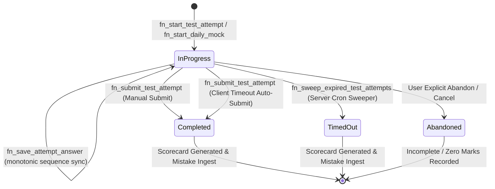
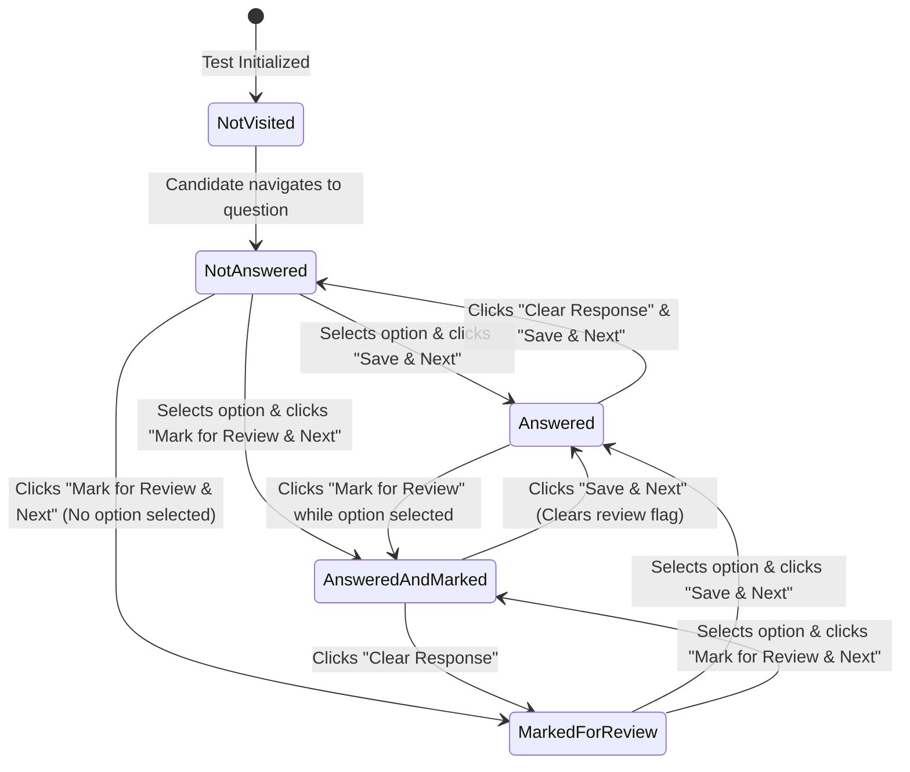
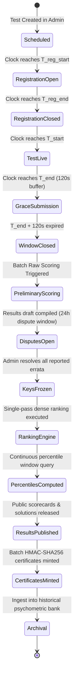
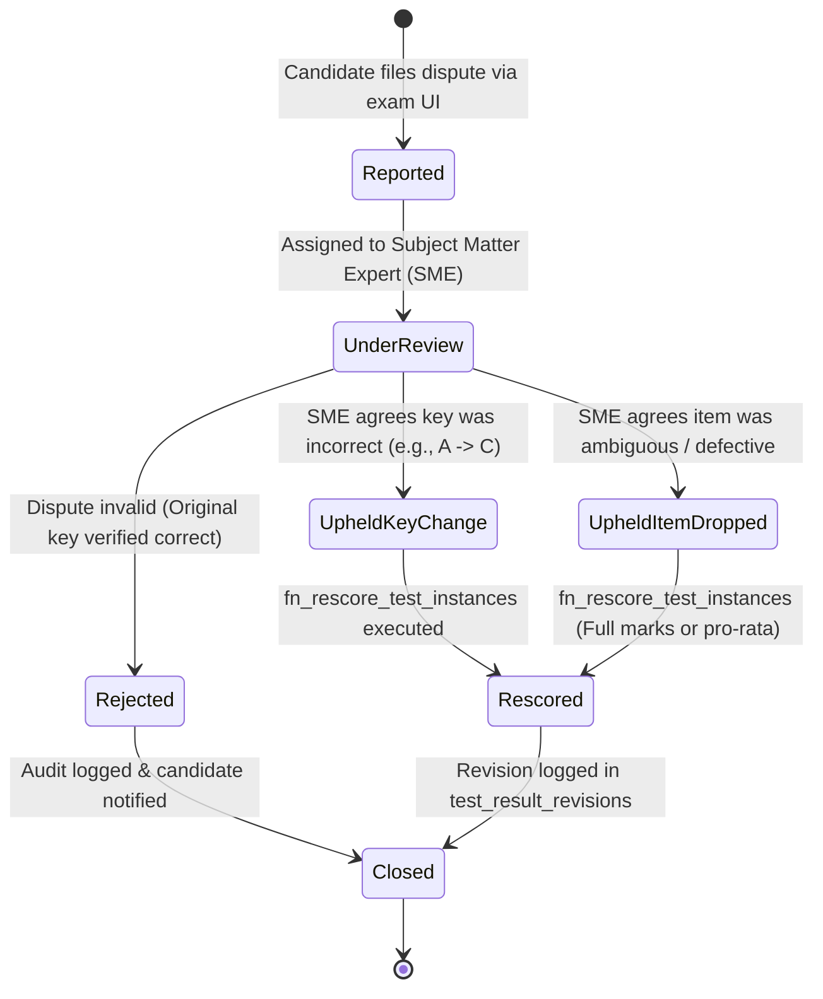
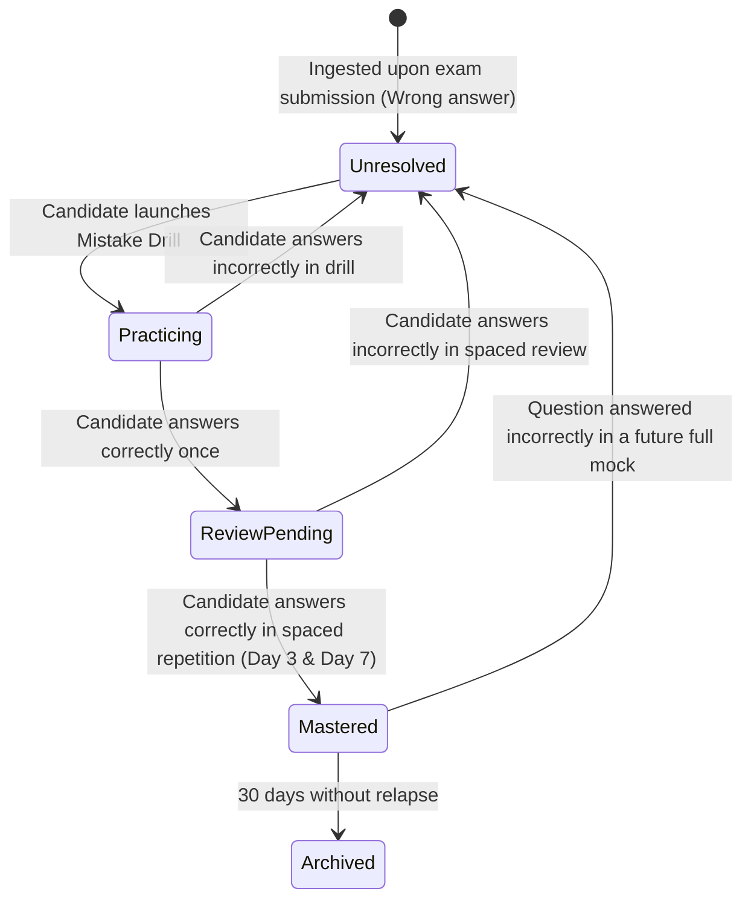

# Appendix D — Complete State Machine Reference

This appendix catalogs all formal finite state machines (FSMs) across the Courage Library Assessment System.

---

## 1. Test Attempt Lifecycle FSM (`test_attempts.status`)

### State Invariants:
- `completed` and `timed_out` are terminal sink states.
- Once an attempt transitions out of `in_progress`, all subsequent `fn_save_attempt_answer` calls are rejected with `ERR_ATTEMPT_CLOSED`.

---

## 2. Exam Player Question Palette State Machine (5 UI States)

### Scoring Evaluation at Submission:
- `Answered` $\implies$ Evaluated for Marks ($+M$ if correct, $-M$ if wrong).
- `AnsweredAndMarked` $\implies$ **Evaluated for Marks** ($+M$ if correct, $-M$ if wrong, matching NTA/TCS standard).
- `MarkedForReview` (No option selected) $\implies$ Treated as Unattempted ($0.0$ Marks).
- `NotAnswered` / `NotVisited` $\implies$ Treated as Unattempted ($0.0$ Marks).

---

## 3. Live All-India Test 14-Stage Lifecycle

---

## 4. Question Dispute & Errata Resolution Lifecycle

---

## 5. Mistake Vault Item Mastery Lifecycle

